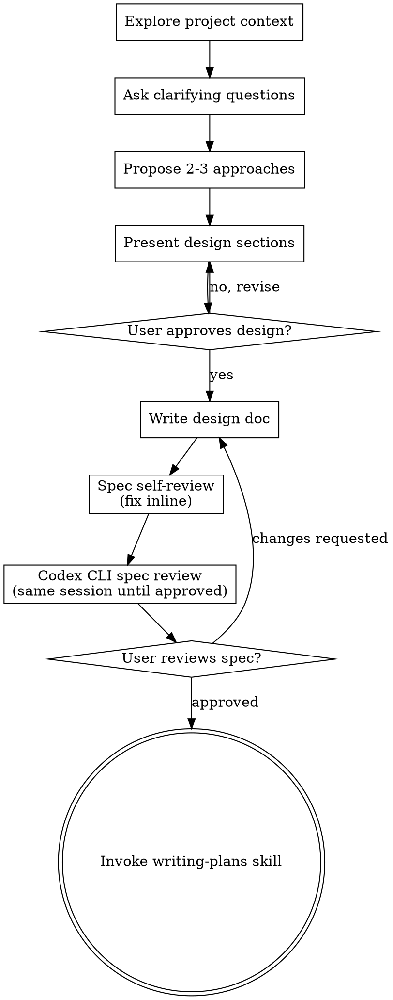

# Brainstorming Ideas Into Designs

Help turn ideas into fully formed designs and specs through natural collaborative dialogue.

Start by understanding the current project context, then ask questions one at a time to refine the idea. Once you understand what you're building, present the design and get user approval.

<HARD-GATE>
Do NOT invoke any implementation skill, write any code, scaffold any project, or take any implementation action until you have presented a design and the user has approved it. This applies to EVERY project regardless of perceived simplicity.
</HARD-GATE>

## Anti-Pattern: "This Is Too Simple To Need A Design"

Every project goes through this process. A todo list, a single-function utility, a config change — all of them. "Simple" projects are where unexamined assumptions cause the most wasted work. The design can be short (a few sentences for truly simple projects), but you MUST present it and get approval.

## Checklist

You MUST create a task for each of these items and complete them in order:

1. **Explore project context** — check files, docs, recent commits
2. **Offer the visual companion just-in-time** — NOT upfront. The first time a question would genuinely be clearer shown than described, offer it then (its own message); on approval its browser tab opens for you. If no visual question ever arises, never offer it. See the Visual Companion section below.
3. **Ask clarifying questions** — one at a time, understand purpose/constraints/success criteria
4. **Propose 2-3 approaches** — with trade-offs and your recommendation
5. **Present design** — in sections scaled to their complexity, get user approval after each section
6. **Write design doc** — save to `docs/superpowers/specs/YYYY-MM-DD-<topic>-design.md` (DO NOT commit — `docs/superpowers/` is gitignored on purpose)
7. **Spec self-review** — quick inline check for placeholders, contradictions, ambiguity, scope; fix issues before external review
8. **Codex CLI spec review** — use a persistent Codex CLI session to review the spec; fix issues and re-review in that same session until Codex approves (see below)
9. **User reviews written spec** — only after Codex CLI approval, ask user to review the spec file before proceeding
10. **Transition to implementation** — invoke writing-plans skill to create implementation plan

## Process Flow



**The terminal state is invoking writing-plans.** Do NOT invoke frontend-design, mcp-builder, or any other implementation skill. The ONLY skill you invoke after brainstorming is writing-plans.

## The Process

**Understanding the idea:**

- Check out the current project state first (files, docs, recent commits)
- Before asking detailed questions, assess scope: if the request describes multiple independent subsystems (e.g., "build a platform with chat, file storage, billing, and analytics"), flag this immediately. Don't spend questions refining details of a project that needs to be decomposed first.
- If the project is too large for a single spec, help the user decompose into sub-projects: what are the independent pieces, how do they relate, what order should they be built? Then brainstorm the first sub-project through the normal design flow. Each sub-project gets its own spec → plan → implementation cycle.
- For appropriately-scoped projects, ask questions one at a time to refine the idea
- Prefer multiple choice questions when possible, but open-ended is fine too
- Only one question per message - if a topic needs more exploration, break it into multiple questions
- Focus on understanding: purpose, constraints, success criteria

**Exploring approaches:**

- Propose 2-3 different approaches with trade-offs
- Present options conversationally with your recommendation and reasoning
- Lead with your recommended option and explain why

**Presenting the design:**

- Once you believe you understand what you're building, present the design
- Scale each section to its complexity: a few sentences if straightforward, up to 200-300 words if nuanced
- Ask after each section whether it looks right so far
- Cover: architecture, components, data flow, error handling, testing
- Be ready to go back and clarify if something doesn't make sense

**Design for isolation and clarity:**

- Break the system into smaller units that each have one clear purpose, communicate through well-defined interfaces, and can be understood and tested independently
- For each unit, you should be able to answer: what does it do, how do you use it, and what does it depend on?
- Can someone understand what a unit does without reading its internals? Can you change the internals without breaking consumers? If not, the boundaries need work.
- Smaller, well-bounded units are also easier for you to work with - you reason better about code you can hold in context at once, and your edits are more reliable when files are focused. When a file grows large, that's often a signal that it's doing too much.

**Working in existing codebases:**

- Explore the current structure before proposing changes. Follow existing patterns.
- Where existing code has problems that affect the work (e.g., a file that's grown too large, unclear boundaries, tangled responsibilities), include targeted improvements as part of the design - the way a good developer improves code they're working in.
- Don't propose unrelated refactoring. Stay focused on what serves the current goal.

## After the Design

**Documentation:**

- Write the validated design (spec) to `docs/superpowers/specs/YYYY-MM-DD-<topic>-design.md`
  - (User preferences for spec location override this default)
- Use elements-of-style:writing-clearly-and-concisely skill if available
- **DO NOT commit the spec.** `docs/superpowers/` is in `.gitignore` by design — specs and plans are local working artifacts, not repository history. The folder being gitignored does NOT mean "don't write here" — read and write freely; just never `git add` or commit anything under `docs/superpowers/`. If you see the folder is empty or untracked, that's expected.

**Spec Self-Review:**
After writing the spec document, look at it with fresh eyes before external review:

1. **Placeholder scan:** Any "TBD", "TODO", incomplete sections, or vague requirements? Fix them.
2. **Internal consistency:** Do any sections contradict each other? Does the architecture match the feature descriptions?
3. **Scope check:** Is this focused enough for a single implementation plan, or does it need decomposition?
4. **Ambiguity check:** Could any requirement be interpreted two different ways? If so, pick one and make it explicit.

Fix any issues inline before starting Codex review.

**Codex CLI Spec Review Gate:**
After self-review passes, review the spec with Codex CLI before asking the user to review it.

1. Check whether Codex CLI is available:

   ```bash
   command -v codex
   ```

2. If `codex` is not installed or not on `PATH`, stop and tell the user:

   > "Codex CLI is required for the spec review gate, but I can't find it on PATH. Do you want me to proceed directly to your review, or wait while you install Codex CLI?"

   If the user says to proceed, go to the User Review Gate. If they want Codex installed first, wait; do not ask for user spec review until Codex CLI is available and has approved the spec.

3. Start one dedicated Codex CLI review session and keep using that same session for every re-review of this spec:

   ```bash
   codex --no-alt-screen -C "$PWD" "You are reviewing a Superpowers design spec for implementation planning. Read skills/brainstorming/spec-document-reviewer-prompt.md and review SPEC_FILE_PATH. Return Approved only if the spec is complete, consistent, clear, appropriately scoped, and YAGNI. Otherwise return Issues Found with specific blocking issues."
   ```

   Replace `SPEC_FILE_PATH` with the actual spec path. Keep this terminal/session open. Do not dispatch a subagent, do not rely on inline self-review, and do not start a fresh Codex session for re-review. If Codex shows a session id, record it immediately.

   If you cannot keep an interactive Codex process open, use non-interactive resume, not a fresh review:

   ```bash
   codex exec -C "$PWD" "You are reviewing a Superpowers design spec for implementation planning. Read skills/brainstorming/spec-document-reviewer-prompt.md and review SPEC_FILE_PATH. Return Approved only if the spec is complete, consistent, clear, appropriately scoped, and YAGNI. Otherwise return Issues Found with specific blocking issues."
   ```

   Then for every follow-up review, resume the recorded session by id:

   ```bash
   codex exec resume SESSION_ID "I updated SPEC_FILE_PATH to address your findings. Re-review the current file in this same review thread. Return Approved only if no blocking issues remain; otherwise return Issues Found."
   ```

   If an interactive Codex session is still open, type or paste the follow-up prompt directly into that session instead of using `resume`.

   If the interactive session is closed and you did not record the session id, do not use `--last`; parallel agents or other Codex work may have created a newer session. Start a new Codex review round from the beginning: ask Codex to review the current spec as a fresh first review, record the new session id, and use that new same session for all follow-up re-reviews. Treat any approval from the lost session as invalid unless the current round also returns `Approved`.

   Tell the user what happened briefly:

   > "I lost the Codex review session id, so I'm restarting the Codex review from the beginning in a new session before asking you to review the spec."

4. If Codex reports issues, fix the spec document, then ask Codex to re-review the current file in the same Codex CLI session. Repeat until Codex returns `Approved`.

**User Review Gate:**
Only after the Codex CLI spec review returns `Approved`, ask the user to review the written spec before proceeding:

> "Spec written to `<path>` and approved by Codex CLI. Please review it and let me know if you want to make any changes before we start writing out the implementation plan."

Wait for the user's response. If they request changes, make them, re-run self-review, then re-run the Codex CLI review loop. Only proceed once the user approves.

**Implementation:**

- Invoke the writing-plans skill to create a detailed implementation plan
- Do NOT invoke any other skill. writing-plans is the next step.

## Key Principles

- **One question at a time** - Don't overwhelm with multiple questions
- **Multiple choice preferred** - Easier to answer than open-ended when possible
- **YAGNI ruthlessly** - Remove unnecessary features from all designs
- **Explore alternatives** - Always propose 2-3 approaches before settling
- **Incremental validation** - Present design, get approval before moving on
- **Be flexible** - Go back and clarify when something doesn't make sense

## Visual Companion

A browser-based companion for showing mockups, diagrams, and visual options during brainstorming. Available as a tool — not a mode. Accepting the companion means it's available for questions that benefit from visual treatment; it does NOT mean every question goes through the browser.

**Offering the companion (just-in-time):** Do NOT offer it upfront. Wait until a question would genuinely be clearer shown than told — a real mockup / layout / diagram question, not merely a UI *topic*. The first time that happens, offer it then, as its own message:
> "This next part might be easier if I show you — I can put together mockups, diagrams, and comparisons in a browser tab as we go. It's still new and can be token-intensive. Want me to? I'll open it for you."

**This offer MUST be its own message.** Only the offer — no clarifying question, summary, or other content. Wait for the user's response. If they accept, start the server with `--open` so their browser opens to the first screen automatically. If they decline, continue text-only and don't offer again unless they raise it.

**Per-question decision:** Even after the user accepts, decide FOR EACH QUESTION whether to use the browser or the terminal. The test: **would the user understand this better by seeing it than reading it?**

- **Use the browser** for content that IS visual — mockups, wireframes, layout comparisons, architecture diagrams, side-by-side visual designs
- **Use the terminal** for content that is text — requirements questions, conceptual choices, tradeoff lists, A/B/C/D text options, scope decisions

A question about a UI topic is not automatically a visual question. "What does personality mean in this context?" is a conceptual question — use the terminal. "Which wizard layout works better?" is a visual question — use the browser.

If they agree to the companion, read the detailed guide before proceeding:
`skills/brainstorming/visual-companion.md`
