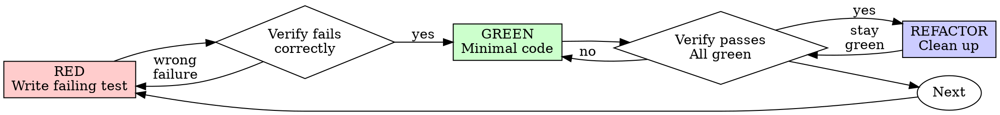

# Test-Driven Development (TDD)

## Overview

**Test logic, not boilerplate.** Decide whether the code under change has logic worth testing. If it does, write the test first, watch it fail, write minimal code to pass. If it doesn't, implement directly and move on.

**Core principle:** If you didn't watch the test fail, you don't know if it tests the right thing. But a test on a passthrough wrapper proves nothing — it asserts that the language works.

## Step 1: Decide If This Code Warrants Tests

Before writing anything, ask: **"What would the test assert that isn't already obvious from the type system or one-line implementation?"**

If the answer is "the value flows through" or "the framework works," skip the test.

**Test when the code has any of:**
- Branching / conditionals / fallbacks (`if (x == null) default else x`)
- Transformation or mapping (DTO ↔ domain model with non-trivial fields)
- Validation rules
- Calculations or aggregation
- State changes / state machines / state management
- Error handling, retries, recovery
- Combining multiple inputs (Flow combine, Result merging)
- Side-effect coordination (ordering, cancellation)

**Skip tests when the code is:**
- Pure delegation — UseCase / Repository method that just forwards to a single source (`fun get() = prefs.getString(KEY, null)`)
- Trivial getters/setters or property exposure
- Plain data classes, DTOs, sealed-class state objects with no methods
- DI / module / Hilt configuration
- Generated code
- Pure Compose UI that just renders state with no decision logic
- One-line wiring / framework adapters where the test would mirror the implementation

**If unsure:** write the test signature mentally. If the test body would just be `verify(repository).get()` or `assertEquals(prefs.value, useCase.get())`, the test is testing the mock or the language — skip it.

## When TDD Discipline Applies

Once you've decided code warrants a test, the TDD discipline below is non-negotiable for *that code*. The decision is what to test; the discipline is how to test it.

**The Iron Law (for code you decided needs tests):**

```
NO LOGIC SHIPS WITHOUT A FAILING TEST FIRST
```

Wrote logic before the test? Delete it. Start over.

**No exceptions:**
- Don't keep it as "reference"
- Don't "adapt" it while writing tests
- Don't look at it
- Delete means delete

Implement fresh from tests. Period.

This rule does NOT mean "every line needs a test." It means: if you decided this code is worth testing, the test comes first.

## Red-Green-Refactor



### RED - Write Failing Test

Write one minimal test showing what should happen.

<Good>
```typescript
test('retries failed operations 3 times', async () => {
  let attempts = 0;
  const operation = () => {
    attempts++;
    if (attempts < 3) throw new Error('fail');
    return 'success';
  };

  const result = await retryOperation(operation);

  expect(result).toBe('success');
  expect(attempts).toBe(3);
});
```
Clear name, tests real behavior, one thing
</Good>

<Bad>
```typescript
test('retry works', async () => {
  const mock = jest.fn()
    .mockRejectedValueOnce(new Error())
    .mockRejectedValueOnce(new Error())
    .mockResolvedValueOnce('success');
  await retryOperation(mock);
  expect(mock).toHaveBeenCalledTimes(3);
});
```
Vague name, tests mock not code
</Bad>

**Requirements:**
- One behavior
- Clear name
- Real code (no mocks unless unavoidable)

### Verify RED - Watch It Fail

**MANDATORY. Never skip.**

```bash
npm test path/to/test.test.ts
```

Confirm:
- Test fails (not errors)
- Failure message is expected
- Fails because feature missing (not typos)

**Test passes?** You're testing existing behavior. Fix test.

**Test errors?** Fix error, re-run until it fails correctly.

### GREEN - Minimal Code

Write simplest code to pass the test.

<Good>
```typescript
async function retryOperation<T>(fn: () => Promise<T>): Promise<T> {
  for (let i = 0; i < 3; i++) {
    try {
      return await fn();
    } catch (e) {
      if (i === 2) throw e;
    }
  }
  throw new Error('unreachable');
}
```
Just enough to pass
</Good>

<Bad>
```typescript
async function retryOperation<T>(
  fn: () => Promise<T>,
  options?: {
    maxRetries?: number;
    backoff?: 'linear' | 'exponential';
    onRetry?: (attempt: number) => void;
  }
): Promise<T> {
  // YAGNI
}
```
Over-engineered
</Bad>

Don't add features, refactor other code, or "improve" beyond the test.

### Verify GREEN - Watch It Pass

**MANDATORY.**

```bash
npm test path/to/test.test.ts
```

Confirm:
- Test passes
- Other tests still pass
- Output pristine (no errors, warnings)

**Test fails?** Fix code, not test.

**Other tests fail?** Fix now.

### REFACTOR - Clean Up

After green only:
- Remove duplication
- Improve names
- Extract helpers

Keep tests green. Don't add behavior.

### Repeat

Next failing test for next feature.

## Good Tests

| Quality | Good | Bad |
|---------|------|-----|
| **Minimal** | One thing. "and" in name? Split it. | `test('validates email and domain and whitespace')` |
| **Clear** | Name describes behavior | `test('test1')` |
| **Shows intent** | Demonstrates desired API | Obscures what code should do |

## Why Order Matters

**"I'll write tests after to verify it works"**

Tests written after code pass immediately. Passing immediately proves nothing:
- Might test wrong thing
- Might test implementation, not behavior
- Might miss edge cases you forgot
- You never saw it catch the bug

Test-first forces you to see the test fail, proving it actually tests something.

**"I already manually tested all the edge cases"**

Manual testing is ad-hoc. You think you tested everything but:
- No record of what you tested
- Can't re-run when code changes
- Easy to forget cases under pressure
- "It worked when I tried it" ≠ comprehensive

Automated tests are systematic. They run the same way every time.

**"Deleting X hours of work is wasteful"**

Sunk cost fallacy. The time is already gone. Your choice now:
- Delete and rewrite with TDD (X more hours, high confidence)
- Keep it and add tests after (30 min, low confidence, likely bugs)

The "waste" is keeping code you can't trust. Working code without real tests is technical debt.

**"Tests after achieve the same goals - it's spirit not ritual"**

No. Tests-after answer "What does this do?" Tests-first answer "What should this do?"

Tests-after are biased by your implementation. You test what you built, not what's required. You verify remembered edge cases, not discovered ones.

Tests-first force edge case discovery before implementing. Tests-after verify you remembered everything (you didn't).

30 minutes of tests after ≠ TDD. You get coverage, lose proof tests work.

## Common Rationalizations

These apply once you've decided the code warrants a test. Skipping the test on logic — or skipping the failure-watch step — is what these counter.

| Excuse | Reality |
|--------|---------|
| "I'll test after" | Tests passing immediately prove nothing. If logic is worth testing, write the test first. |
| "Tests after achieve same goals" | Tests-after = "what does this do?" Tests-first = "what should this do?" |
| "Already manually tested" | Ad-hoc ≠ systematic. No record, can't re-run. |
| "Deleting X hours is wasteful" | Sunk cost fallacy. Keeping unverified logic is technical debt. |
| "Keep as reference, write tests first" | You'll adapt it. That's testing after. Delete means delete. |
| "Need to explore first" | Fine. Throw away exploration, start with TDD. |
| "Test hard = design unclear" | Listen to test. Hard to test = hard to use. |
| "Manual test faster" | Manual doesn't prove edge cases. You'll re-test every change. |
| "Existing code has no tests" | If you're changing logic, add a test for the change. |

**Counter-rationalizations — don't skip tests on logic by mislabeling it boilerplate:**

| Excuse | Reality |
|--------|---------|
| "It's just a UseCase" | UseCases with mapping, fallbacks, or combining are logic. Test them. |
| "It's just a Repository" | Repositories with caching, error mapping, or merging sources are logic. Test them. |
| "It's just a ViewModel" | ViewModels managing state, side effects, or transformations are logic. Test them. |
| "It's just one if-statement" | One branch is logic. Two paths exist; test both. |

## Red Flags - STOP and Start Over

For code you decided needs tests:
- Code before test
- Test after implementation
- Test passes immediately
- Can't explain why test failed
- Tests added "later"
- "I already manually tested it"
- "Keep as reference" or "adapt existing code"
- "Already spent X hours, deleting is wasteful"

For the test-decision step:
- Calling something "boilerplate" because you don't want to test it
- Skipping tests because the class name has "UseCase" / "Repository" / "ViewModel" in it (the name doesn't decide; the body does)
- Skipping tests on a method with branching, mapping, or error handling

**When in doubt about whether to test, ask: "If I rewrote this from scratch, would the test catch a behavior bug?" Yes → test. No → skip.**

## Example: Bug Fix

**Bug:** Empty email accepted

**RED**
```typescript
test('rejects empty email', async () => {
  const result = await submitForm({ email: '' });
  expect(result.error).toBe('Email required');
});
```

**Verify RED**
```bash
$ npm test
FAIL: expected 'Email required', got undefined
```

**GREEN**
```typescript
function submitForm(data: FormData) {
  if (!data.email?.trim()) {
    return { error: 'Email required' };
  }
  // ...
}
```

**Verify GREEN**
```bash
$ npm test
PASS
```

**REFACTOR**
Extract validation for multiple fields if needed.

## Verification Checklist

Before marking work complete:

- [ ] Every function/method with logic has a test (passthroughs and DI/config code don't)
- [ ] For each test written: watched it fail before implementing
- [ ] Each test failed for expected reason (feature missing, not typo)
- [ ] Wrote minimal code to pass each test
- [ ] All tests pass
- [ ] Output pristine (no errors, warnings)
- [ ] Tests use real code (mocks only when unavoidable, never just to test the mock)
- [ ] Edge cases and errors covered for tested logic

Tests-first only applies to the code you decided needs tests. Skipping a test on a passthrough is fine; skipping the failure-watch on logic is not.

## When Stuck

| Problem | Solution |
|---------|----------|
| Don't know how to test | Write wished-for API. Write assertion first. Ask your human partner. |
| Test too complicated | Design too complicated. Simplify interface. |
| Must mock everything | Code too coupled. Use dependency injection. |
| Test setup huge | Extract helpers. Still complex? Simplify design. |

## Debugging Integration

Bug found? Write failing test reproducing it. Follow TDD cycle. Test proves fix and prevents regression.

Never fix bugs without a test.

## Testing Anti-Patterns

When adding mocks or test utilities, read @testing-anti-patterns.md to avoid common pitfalls:
- Testing mock behavior instead of real behavior
- Adding test-only methods to production classes
- Mocking without understanding dependencies

## Final Rule

```
Logic with branching, transformation, validation, state, or error handling
  → test exists and failed first
Pure passthrough, config, generated code, trivial accessors
  → no test needed; implement directly
```

The decision is yours: what is logic, and what is glue. The discipline applies once you've decided to test.
